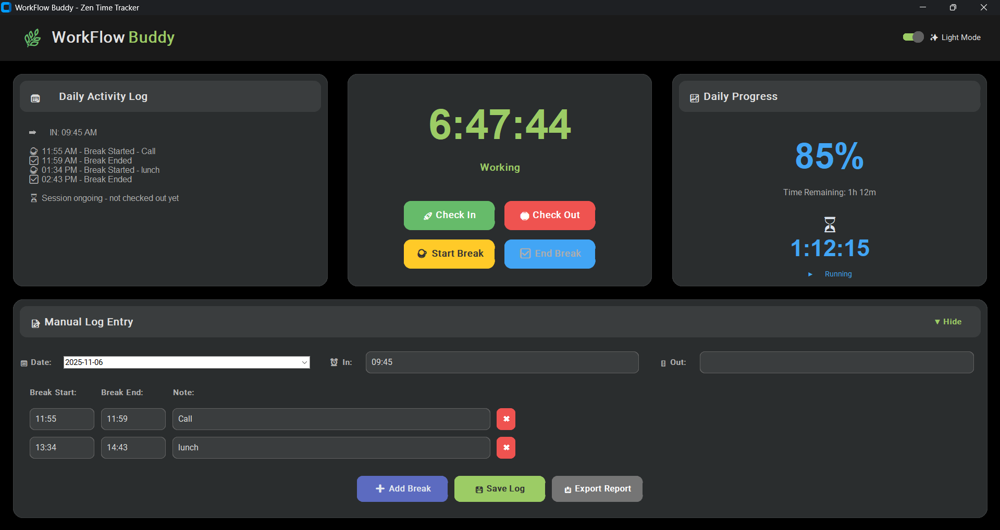
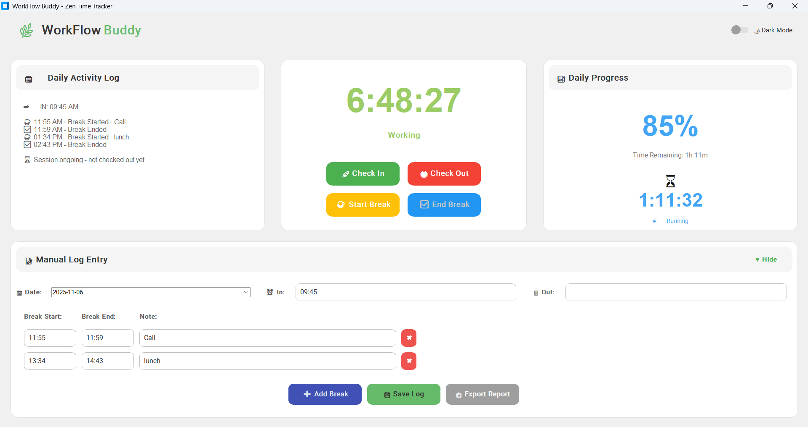

# ⚡ WorkFlow Buddy  
**Your not-so-judgy, super chill time-tracking buddy for Windows**  

Let’s be real — you’re deep in code, coffee’s gone cold, and suddenly it’s 3 PM. Did you even take a lunch break? WorkFlow Buddy keeps track of your hours, your breaks, and your “oops-I-lost-track-of-time” in break moment — all in a clean, distraction-free interface.  

---

## 🚀 Quick Start  

### Installation  

1. Download **`WorkFlowBuddy.exe`**  
2. Double-click to run — literally zero installation needed.  

> ⚠️ Heads up: Windows might freak out and say “Windows protected your PC.”  
> Click **More info → Run anyway** — I promise it’s safe.  

---

## ✨ Why You’ll Actually Use This  

| Feature | The Real Deal |
|----------|---------------|
| ⚡ **Instant Check-In/Out** | One click to start or end your workday — no thinking required |
| ☕ **Break Tracking** | Coffee, lunch, snack, nap? Log it all (or just pretend you did) |
| 📊 **Live Progress View** | Watch your daily progress move like a tiny victory bar |
| ⏱️ **Countdown Timer** | “Only 37 minutes left before I can stretch” — visualized beautifully |
| 📋 **Activity Log** | Everything you did (even the weird 2 AM “coding epiphany”) is saved |
| ✏️ **Manual Edits** | Forgot to check in after a 3-hour coding binge? Fix it like a pro |
| 📥 **Export to CSV** | Show your boss you’re not just staring at your screen all day |
| 🌙 **Dark & Light Modes** | Match your vibe — night owl or day warrior |
| 💾 **Local Storage** | Your secrets stay on your machine, nowhere else |

---

## 📸 Sneak Peek  

### 🖥️ Dashboard

Stuff you’ll actually notice:  
- Clock that actually keeps track of time while you lose track of everything else  
- A helpful “nudger” when you’ve been at your desk too long  
- Progress bar for small wins (because yes, finishing a task counts!)  
- Break logs for when you finally remember you’re human  
- Manual logs because life is messy  

---

## 📖 How to Actually Use It  

### 1️⃣ Start Your Day  
Open **WorkFlow Buddy** → hit **Check In** → now you’re officially adulting.  

### 2️⃣ Take Breaks  
Click **Break** when you step away. Label it (like *Coffee*, *Lunch*, or *Oops, I forgot to eat again*) — we won’t judge.  

### 3️⃣ Wrap Up  
Hit **Check Out** at the end of your day. Export your stats, see your streak, feel smug about being productive.  

---

### 💡 Pro Tip  
Keep it open while coding. It’s lightweight, unobtrusive, and secretly judges you when you forget to eat.  

---

## 🔮 What’s Coming  

- [ ] Pomodoro mode (because timing your breaks actually works)  
- [ ] Mac/Linux support — no PC left behind  
- [ ] Cloud sync (your productivity, everywhere)  
- [ ] Analytics dashboard — see how long you stare at your code vs actually writing it  

---

## 🤝 Wanna Help?  

Pull requests are welcome! Big changes? Open an issue first so we can brainstorm together.  

---
MEEE License — you can do almost anything with it. Just don’t sue me if your boss notices you took a 4-hour nap. 😉  
